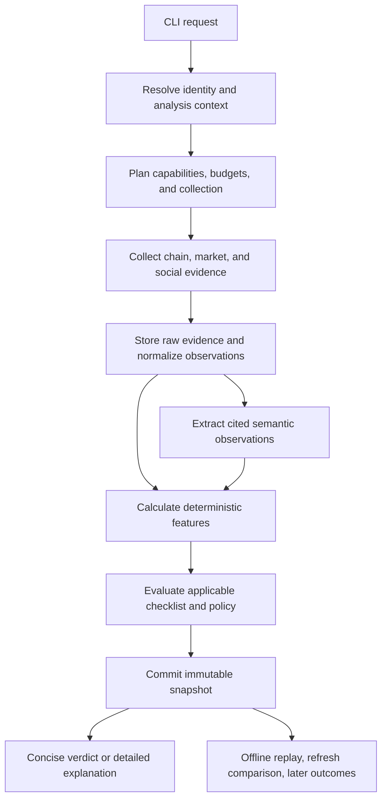

# Backend architecture

This is a proposed system. Directory names and functions below describe what the implementation task should create. The current repository contains no application code.

## 1. Design around a decision, not a token score

The analysis subject is `DD(token, time, size, horizon, policy, evidence)`. A token address alone does not determine a verdict. The same asset may satisfy a small-size policy and fail a larger-size policy; evidence collected yesterday is not current execution evidence.

Maintain these separate outputs:

| Output | Meaning |
|---|---|
| Structural assessment | What supported token and venue mechanisms could prevent transfers, change supply, confiscate value, or alter trading? |
| Execution assessment | What can the requested size plausibly receive through verified routes under a documented state and simulation method? |
| Opportunity evidence | Which narrative, attention, and social observations support the hypothesis, and what contradicts it? |
| Evidence assessment | Which required observations are present, fresh, complete enough, and trustworthy for their particular use? |
| Policy verdict | Which versioned rules passed, failed, could not run, or do not apply? |
| Management assessment | Against a saved thesis, what still holds, what invalidated it, and which specified reduction/exit proposal is supported now? |

Never let favorable attention compensate for a failed mechanical gate. Never let missing evidence become a favorable number. Never confuse a successful data fetch with a successful check.

## 2. One process, explicit boundaries

Use a **TypeScript modular monolith** with a CLI, a local SQLite database, and content-addressed raw artifacts. The first release covers Solana, BSC, Base, and Robinhood, with paid data/API calls disabled by default. There is one deployable application. Features and policy are ordinary pure functions; adapters handle network I/O; the orchestrator coordinates them. Add a server interface only when a real consumer needs one.

TypeScript is the recommended implementation language because chain integrations and typed JSON contracts fit the workload, and the supplied pre-plan already expresses its domain in that idiom. Python would be reasonable for later statistical research; a second production runtime is not needed to launch the CLI. This choice is a project recommendation, not an inherited repository constraint.

Recommended initial tool choices:

| Concern | Proposed choice | Why / implementation proof |
|---|---|---|
| Runtime | Node.js 24 LTS, exact supported patch pinned at P00 | Official release table currently lists v24 as LTS; validate SDK support on Windows and CI before locking. [Node releases](https://nodejs.org/en/about/previous-releases) |
| Dependencies | npm, committed lockfile, `npm ci` | One deterministic install path; no second package manager |
| Types/runtime boundaries | TypeScript strict mode plus Zod schemas | Infer types from schemas where possible; validate external inputs rather than merely asserting types |
| CLI | Commander | Small command surface, JSON output, no interactive dependency |
| HTTP | Native fetch plus one local retry/rate-limit wrapper | Consistent timeouts, cancellation, budgets, and normalized errors |
| Numeric operations | bigint for atomic quantities; decimal.js for ratios/USD | Avoid float rounding for supply, fees, and high-decimal assets |
| EVM | viem public clients and explicit ABI decoders | Read/simulate only; no wallet client exposed to DD |
| Solana | Compatible maintained Solana RPC/token decoding SDK chosen at P00 | Verify Token-2022 decoder and venue SDK compatibility; pin one compatible family rather than combining SDK generations casually |
| Persistence | SQLite through better-sqlite3; SQL migrations | Verify Windows prebuilt/runtime compatibility in P00; no network database prerequisite |
| Tests | Vitest, fixture replay, CLI subprocess tests | Test real domain functions and adapter normalization |
| Logs | Pino JSON logs to stderr | Machine-readable progress and correlated diagnostics |
| LLM | Gemini 3.5 Flash-Lite/high preferred; import bootstrap and explicit offline mode | Verified free access and quality before hosted activation; no autonomous tools inside extraction; see [08](08-technology-decisions.md) |

Exact package versions are an implementation feasibility result, not fabricated in this plan. P00 must lock a compatible set and exercise install, build, a database round trip, and both chain-family decoding paths before feature work. If better-sqlite3 cannot be supported in the target runtime, document the evidence and choose a supported SQLite driver; do not silently change the entire storage architecture.

SQLite fits a local application and keeps operation simple. Reconsider Convex or a conventional server database when measured concurrent-writer demand, cloud scheduling or remote multiuser access justifies it. This is not a predetermined migration. See the explicit [SQLite/Convex comparison](08-technology-decisions.md). [SQLite deployment guidance](https://www.sqlite.org/whentouse.html)

## 3. The complete run



### Step 1: resolve the input

Accept a raw address, an explicit `--chain`, or a recognized explorer/DEX URL. Supported URL parsers extract identifiers without fetching an arbitrary supplied host. Normalize EVM addresses to a canonical comparison form while preserving a checksummed display; retain Solana base58 case and verify the decoded key length.

A 20-byte EVM address may exist on several chains. Search only the configured chain set. Provider discovery can propose candidates; chain state validates whether the address is a supported token. If two candidates remain, return `AMBIGUOUS_CHAIN` with the candidate list. In JSON/noninteractive mode never guess from popularity. In a terminal, offer a selection. No candidates means unresolved identity, not “zero holders.”

An explicit chain is still checked against the endpoint's actual chain identity. Mainnet and testnet are different records. A Solana public key must resolve to a mint owned by an approved token program, not merely be syntactically valid. An EVM contract must provide supported token semantics; a pool, EOA, NFT, or arbitrary bytecode is not silently accepted as an ERC-20.

### Step 2: establish context and capabilities

Resolve position size, quote asset, horizon, policy version, requested depth, input budget, and wall-clock deadline. Apply only explicit saved defaults and print which ones were used. If size/horizon are missing, continue in diagnostic mode and mark the context check UNKNOWN.

Read the chain/venue/provider capability matrix before dispatching requests. This matrix states what can be collected, with which limitations. Unknown venue support does not trigger a random router call. Plan cheap identity and structural reads before expensive social/actor expansion.

### Step 3: collect a bounded snapshot

Set `collectionStartedAt`. Anchor chain reads to a block/slot where supported. Concurrently collect independent observations within provider rate limits and the shared budget. Preserve each provider's actual timestamp and cursor; do not label all data as simultaneous.

Run all three baseline pillars for a valid subject. A hard failure may skip expensive enrichments, but skipped items must say `SKIPPED_DEPENDENCY`, with the dependency identified. The default report still explains the fatal reason and which pillars were not completed. `--depth full` can request additional authorized diagnostics subject to the same budget.

Capture `collectionCompletedAt`, the observed block range, finality, maximum timestamp skew, and provider freshness. A long run refreshes execution-critical reads once within its budget or marks them stale. This prevents a current social report from presenting a several-minute-old exit quote as actionable.

### Step 4: normalize evidence

Persist raw bodies or permitted excerpts before transformation. Store sanitized request metadata, response status, raw content hash, adapter version, event time, publication time where relevant, observation time, collection time, and knowledge availability time.

Normalize chain identities, token units, quote currencies, timestamps, pool orientation, and social authors. Keep vendor claims separately from direct observations. Missing, explicit zero, stale, conflict, unsupported, and truncated are different states. A schema violation becomes a provider error with recoverable evidence, not a default value.

### Step 5: extract semantics

Supply a bounded evidence packet to the LLM: sampled/deduplicated posts, contract-bound metadata, relevant external sources, and candidate competitor descriptions. Deterministic collection owns search queries and source access. The LLM cannot open links, choose an arbitrary chain, create an unobserved wallet identity, or fetch a new competitor.

The extractor identifies narrative, game type, origin claims, post roles, relationships, and contradictions. Every substantive claim references evidence IDs and spans. A deterministic validator checks schema, references, temporal consistency, and allowed entities. Unverifiable claims are rejected or stored as hypotheses with no gate authority.

### Step 6: compute and evaluate

Pure feature functions consume a frozen observation manifest plus validated semantic observations. They return typed values, supporting observation IDs, applicability, and limitations. The rule engine evaluates the exact published checklist. The verdict is derived from rule outcomes, not written by the LLM.

Store inputs, feature outputs, checks, policy hash, semantic extraction version, and headline response together. A snapshot is immutable after finalization. New collection, new labels, or a new policy creates a successor linked to the original.

### Step 7: show, explain, refresh, compare

Default output contains verdict, reason class, chain/token, size/horizon, snapshot time, pillar summaries, top supporting/contradicting reasons, and material missing evidence. Full checklist is saved even when hidden. `explain` retrieves it without recollecting anything. `refresh` creates a new snapshot; `diff` separates evidence changes from policy/model changes.

## 4. Modules and ownership

The proposed tree is a map of responsibilities, not an instruction to create empty directories before they are needed.

```text
src/
  cli/                  argument handling, output formatting, exit codes
  application/          analyze, explain, replay, refresh, diff, outcome services
  domain/               schemas, identifiers, errors, policy and observation contracts
  collection/           request plans, budgets, rate limits, cursors, evidence manifests
  chains/
    evm/                token state, proxy/control inspection, pinned reads
    solana/             mint/program/extensions, token-account owner aggregation
  venues/               recognized factory/program and pool/curve adapters
  providers/            DEX Screener, selected indexer, GMGN/GoPlus, X, Telegram, web
  semantic/             packet builder, extractor schema, prompt version, validation
  features/             onchain, attention, social, shared context
  policy/               applicability, checklist evaluator, verdict derivation
  storage/              SQL migrations, artifact store, repositories
  reporting/            deterministic summary and optional grounded explanation
config/
  chains/               network identity and capabilities, no secrets
  venues/               deployment allowlists and version provenance
  policies/             named, hashed policy manifests
  sources/              public source lists and collection limits
tests/
  fixtures/             sanitized vendor/chain/semantic evidence
  unit/                 feature/rule behavior
  contract/             provider normalization and JSON schema
  integration/          real SQLite + offline end-to-end + CLI
  live/                 opt-in bounded reads and simulation probes
data/                   ignored local runtime data; never production fixtures
```

Domain code does not import providers, CLI, or database drivers. Features never call the network. A provider does not decide PASS/FAIL. A venue adapter does not know how many X authors mentioned a token. The application layer owns composition and error propagation.

Avoid a universal `getEverything()` provider interface. Implement small capability interfaces such as `readTokenState`, `listMarkets`, `readHolderSnapshot`, `readTrades`, `searchPosts`, and `estimateRoute`. A vendor implements only what it genuinely supports. Add adapters when selected, not as stub scaffolding for every possible source.

## 5. Chain and venue are separate dimensions

The chain adapter establishes token identity, state, transactions, and finality. The venue adapter establishes pool/curve identity, route mechanics, fees, migration state, and liquidity control. A token can trade in many markets; the largest reported pair is not automatically its canonical or safest route.

Use a versioned venue registry keyed by network, factory/program, code identity where available, and supported protocol version. Verify the pool belongs to the expected token pair. Name/symbol, URL suffix, or a token address ending in a familiar string is not venue provenance.

Initially certify Pump bonding curves and canonical PumpSwap paths on Solana, PancakeSwap V2 paths on BSC, Uniswap V3 paths on Base, and a certified Uniswap V4 deployment on Robinhood, initially restricted to no-hook or explicitly supported hook paths. Current official Uniswap deployment documentation lists Robinhood V4; deployment identities and usable pools must still be verified in P00/P04. V4 pool identity includes its PoolKey under a manager and cannot reuse a V3 pool-address model. These are bounded starting targets, not statements that they cover all relevant trading. Raydium, Meteora, Four.meme, Aerodrome, V4 hooks, and other venues require their own certification. Aggregator discovery may find them; full execution checks must not inherit another venue's PASS.

Protocol-controlled liquidity is evaluated by its actual controls. A V2 LP token, a V3 NFT position, a bonding curve, and a protocol-managed pool have different withdrawal mechanisms. A generic `LP unlocked => FAIL` rule is prohibited. Locks, if relevant, must cover the actual position and remain effective through the analysis horizon; a website badge is not sufficient evidence.

## 6. Execution evidence has levels

Store the evidence level explicitly:

1. `INDICATIVE`: market/pool estimate with no executable route.
2. `QUOTED`: route response for a particular amount and state context.
3. `SIMULATED`: supported instructions/calls executed in a documented read-only simulator with state and assumptions captured.

Actual execution is outside scope. None of these levels guarantees a future fill. “No quote” can mean unsupported route, provider failure, or no liquidity; distinguish the cause.

For an intended quote spend `S`, estimate acquired atomic token quantity `q` after entry fees/taxes. Evaluate selling `q`; do not request a generic “$S sell” and assume it is the same position. For constant-product venues, stateful round-trip simulation applies the entry's reserve changes before exit. Two independent quotes at unchanged reserves are labeled `INDEPENDENT_QUOTES`, not a simulated round trip.

Output entry impact, exit impact, net round-trip proceeds, route fees, token taxes, native gas/priority costs, quote conversion source, and minimum-out assumptions separately. Provider price-impact definitions may exclude fees; normalization cannot collapse all losses into one undocumented percentage.

Evaluate a configured diagnostic size grid plus the requested size, sort/deduplicate it, and respect quote-call caps. Do not extrapolate a constant-product formula onto concentrated liquidity, discrete liquidity bins, V4 hooks, or custom curves. For an ordinary constant-product pool only, with input reserve `x`, output reserve `y`, fee fraction `f`, and input `a`, an indicative output is `y * a*(1-f)/(x+a*(1-f))`, with protocol-specific integer rounding. Transfer taxes and protocol fee changes need separate treatment.

A stateful EVM test can use an isolated pinned fork and an ephemeral test account funded in that fork. Acquire tokens via a simulated buy, approve in the fork, then sell; never send approvals to mainnet. Record sender, allowance, block, implementation code, and state overrides. A single `eth_call` cannot prove a buy/approve/sell sequence. Tokens may behave differently by sender or later block; report the scenario tested.

On Solana, `simulateTransaction` uses existing state; a missing balance/account can invalidate the test setup rather than prove a honeypot. A venue simulator or controlled local state environment must account for the acquired balance and transaction dependencies. If only a quote is feasible, retain QUOTED and leave the simulation requirement UNKNOWN. [Solana simulation contract](https://solana.com/docs/rpc/http/simulatetransaction)

## 7. Ownership, control, and market integrity

Aggregate Solana token accounts by owner before holder percentages. Label pool vaults, burns, escrow, bridges, and custodians with evidence; do not casually remove a large address because a vendor calls it an exchange. Report raw-supply and adjusted economic-holder views together with excluded quantities.

EVM logs alone are not universally sufficient to reconstruct holdings: rebases, missing history, custom transfers, and proxy upgrades can break naive accounting. Use indexed holder snapshots with declared coverage, then verify sampled/top balances at the selected state. Solana's largest-token-accounts RPC result is a limited list of token accounts, not the complete owner distribution. [Solana RPC reference](https://solana.com/docs/rpc/http/gettokenlargestaccounts)

Relationships are evidence-bearing edges. Common exchange funding or simultaneous purchases are association evidence, not proof of common ownership. Keep hard identity/transfer edges distinct from inferred coordination. Do not use transitive closure on weak edges to turn the entire market into one owner. Cluster outputs include method version, evidence bounds, coverage, and sensitivity to the clustering rule.

Wash-trade and bundle features identify patterns under a specified method. Their deterministic calculation does not make their interpretation certain. Known protocol bots and normal arbitrage must be marked separately. A study motivating this work documents manipulation in a particular sampled population; its reported prevalence is not a prior that every analyzed token has the same fraud probability. [USENIX study](https://www.usenix.org/conference/usenixsecurity26/presentation/mongardini)

## 8. Attention and social data share a collection layer

Collect exact contract mentions first. Ticker/name/narrative searches are separate query classes with their own ambiguity filters. Bind a post to a token using explicit address, a verified link, or a documented semantic association; retain unresolved ticker mentions outside token-specific counts.

Store posts, authors, call events, source relationships, and metrics with stable provider IDs. A repost may count as propagation but should not count as a new independent origin. Multi-label facets include external/crypto origin, paid disclosure, suspected coordination, bot-like behavior, caller role, and price focus. They are not mutually exclusive percentages summing to 100.

Attention magnitude is an observed sample. Do not call follower totals “unique reach,” or confuse public search results with all platform activity. Search caps, deleted posts, access restrictions, language filters, and collection changes accompany each series. Sparse observations support descriptive claims with bounded scope; they do not support precise global saturation.

Narratives are separate entities linked to tokens through versioned associations. Candidate-scoped competitor discovery searches the narrative, extracts explicit contract references, validates those contracts, and compares the observed set. A 100% share among one discovered token is not proof of global canonicality. The report names the competitor-set coverage and contested associations.

## 9. Time, persistence, and replay

Use UTC internally. Store chain event time, source publication time, first collection time, source revision time if provided, and `availableAt`: when this system could use that exact observation. A post fetched today with yesterday's timestamp was not necessarily available to yesterday's run.

SQLite holds normalized entities, observations, runs, manifests, features, checks, and snapshots. Raw artifacts live under `data/artifacts/sha256/...`, written to a temporary file then atomically renamed. A finalization transaction references only committed artifacts. A crash may leave unreferenced files; cleanup can remove them after a grace period. A finalized snapshot must never point to a partial file.

Enable foreign keys, migrations, WAL where supported, a bounded busy timeout, and short transactions. Serialize writes through the application. Record a schema migration version; back up using the database backup API, not a casual copy of an active database file. `doctor` checks a write/read round trip, writable paths, schema version, credentials presence without values, and capabilities.

No background collector is required initially. Manual analyses accumulate history. Optional collection for an explicit watched set may be added in the research-depth milestone; it needs a persistent job table and source cursors before any external queue. A restarted job resumes idempotently and does not duplicate posts or trades.

Corrections, reorg invalidations, and source deletions are append-only events/tombstones. Existing verdicts retain their historical decision record but are labeled superseded/invalidated when relevant. Retention obligations can require payload deletion; retain permitted metadata and a tombstone, mark replay limitations, and never promise eternal raw social storage.

## 10. Failure behavior and operational limits

Errors use `{code, message, retryable, source, details?}` with sanitized details. Examples include `AUTH_REQUIRED`, `RATE_LIMITED`, `BUDGET_EXHAUSTED`, `UNSUPPORTED_CAPABILITY`, `SCHEMA_CHANGED`, `STALE_DATA`, `CONFLICTING_DATA`, and `SIMULATION_SETUP_FAILED`. A provider failure usually yields a partial report; invalid request or storage failure prevents a finalized snapshot.

Use bounded exponential retry for transient reads, respecting Retry-After. Do not retry invalid credentials or deterministic schema errors repeatedly. Reserve budget before dispatch, including concurrent requests; reconcile actual costs afterward. LLM retries have their own cap and never replace a valid stored extraction during replay.

Provisional performance budgets to measure, not claim: offline replay under two seconds for a normal saved snapshot; baseline collection deadline 120 seconds; full enrichment deadline 300 seconds. Completion at deadline produces partial evidence, not an unbounded loop. Provider-specific limits and per-run page/post/byte/token ceilings are configuration.

Log run ID, stage, provider, elapsed time, retry count, error code, observation count, truncation, and estimated/actual cost. Do not log credentials, full authenticated URLs, Telegram session material, or unrestricted raw posts. Record stage timings and unknown-check rates so missing coverage can be improved deliberately.

## 11. Security boundary

DD needs read-only API credentials and no trading keys. Do not expose transaction-send functions through its interfaces. RPC allowlists exclude send/broadcast methods. Simulations are local or read-only provider operations. If a vendor combines trading and research in one credential, choose a read-only permission configuration where possible and enforce an application-side operation allowlist.

Treat token metadata, websites, and posts as untrusted data. Strip terminal control sequences from CLI output. Prevent spreadsheet-formula injection in any later CSV export. Guard HTTP fetches against private/link-local destinations, unsafe redirects, oversized responses, and unsupported schemes; parse supplied URLs before deciding whether to fetch. Never execute code, install packages, or follow instructions from a token site.

Semantic extraction receives no secrets, filesystem access, shell, or posting tools. Evidence text can contain “ignore your rules”; it remains quoted data. Evidence-reference and schema validation are mandatory but are not represented as complete hallucination prevention.

## 12. Extension points and stopping conditions

Revision 0.2 adds baseline advisory chart and market-context calculations under the existing features/collection boundaries, specified in [07](07-round-two-lessons-and-contracts.md). No fourth service or pillar is needed. C08/C13/C14 consume completed, time-qualified market series; C09/C11/C12/C15/C16 consume bounded macro/chain/launch observations. A06 adds baseline cited attention-style hypotheses. Candidate/source discovery remains deterministic and bounded; TinyFish/Parallel retrieval is an adapter choice under [08](08-technology-decisions.md).

Never accept or store seed phrases/private keys. Phase 1 journal/research-plan records contain no signing material and are local by default; public evidence packets alone go to external retrieval/inference until private-data use is deliberately configured. P11 now implements manual management within Phase 1; P12 paper execution remains separate future scope. Create these tables only in their owning packet, not as empty foundation scaffolding.

The future researcher calls the same `analyze` application service with a candidate list. A future trader consumes a snapshot reference but must perform fresh execution/risk checks in its own system. A future UI calls the application service through a thin API. None requires moving scoring into an autonomous LLM.

Stop the first implementation when supported live inputs produce truthful snapshots across the agreed chain/venue set, the checklist can be explained, replay is stable, failure cases are tested, and known missing capabilities are visible. Do not build a graph database, vector database, Kafka pipeline, real-time scanner, or portfolio service to satisfy a pasted-contract workflow.

P07 is the entry-engine milestone, not complete Phase 1. The user requires P11's manual management workflow too: see [09](09-two-checklist-lifecycle.md). Add `ResearchCase`, `ThesisEpisode`, optional position events and management snapshots under the existing application/domain/storage boundaries when implementing P11. The analyze service dispatches new cases to entry and tracked cases to reassessment; it never dispatches orders. No new service/queue is needed. Features are shared; entry and management evaluators are separate pure functions with separately hashed manifests.


